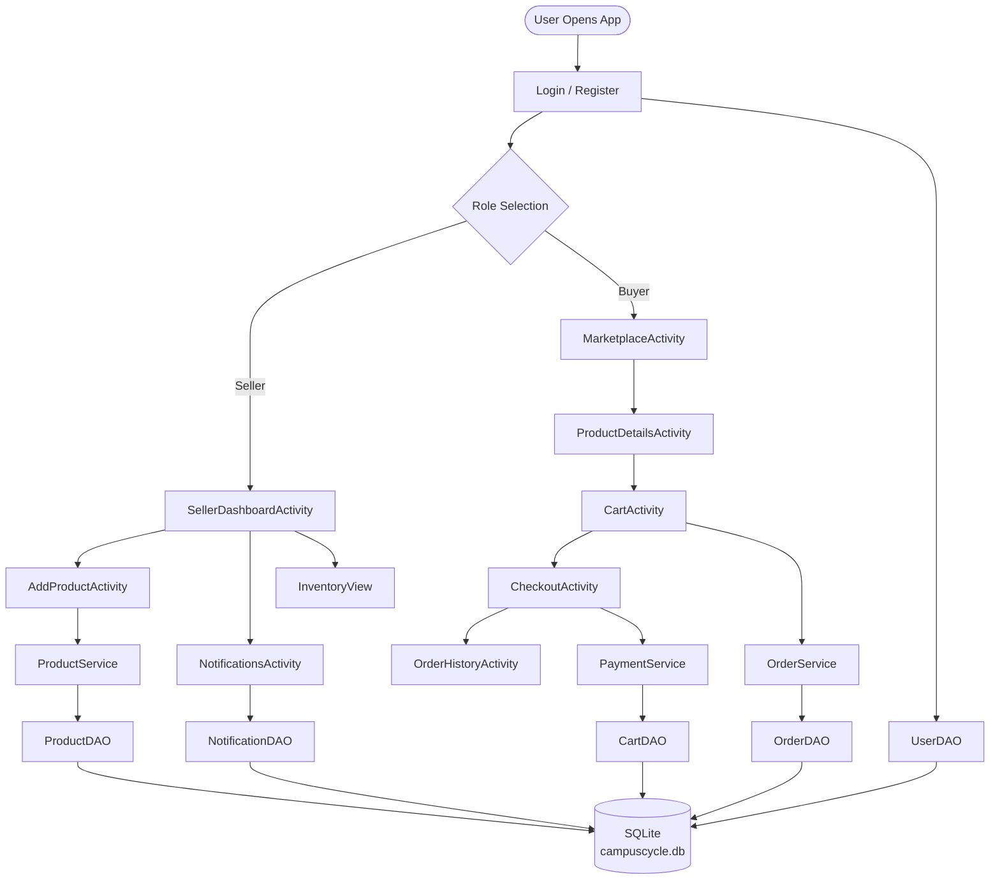
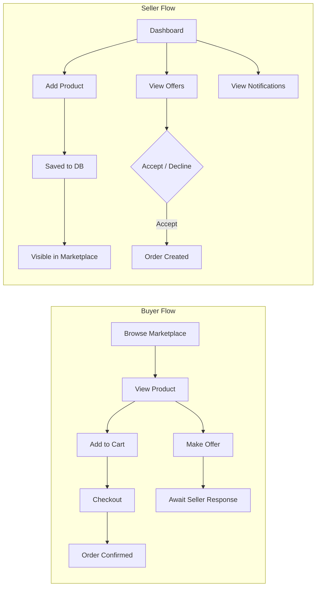
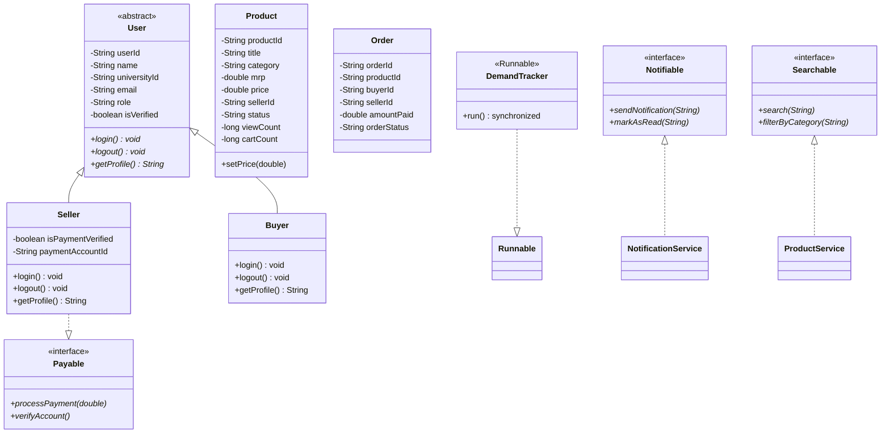
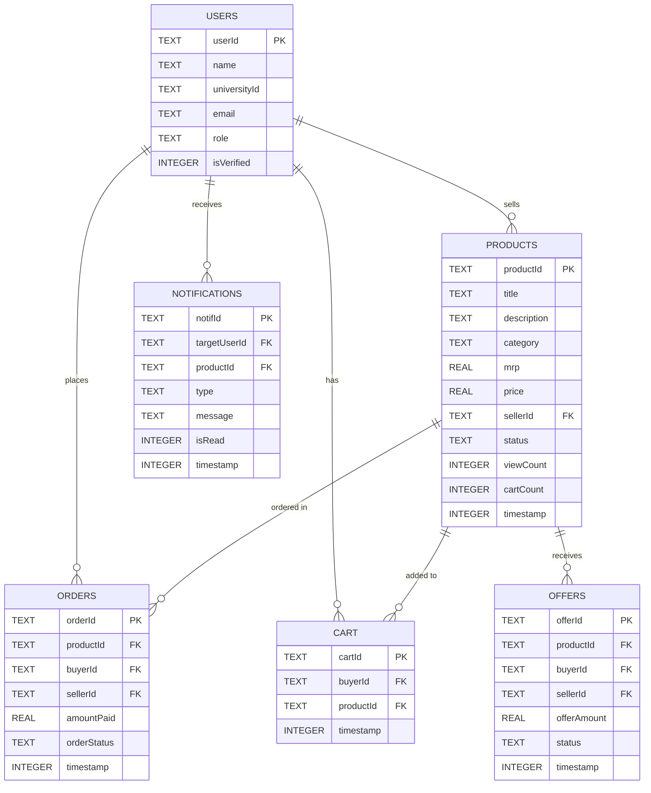

# CampusCycle
### A University-Based Second-Hand Commerce Platform for Sustainable Student Living

**Built with** Java · Android · SQLite  
**Team:** Anshika Gupta · Hetanshi Vora · Atlas SkillTech University

---

## Overview

CampusCycle is a university-exclusive second-hand e-commerce Android application. Students can buy and sell pre-owned goods within a verified campus ecosystem using role-based access, SQLite persistence, and a clean layered architecture.

---

## Features

**Buyer**
- Browse and search the marketplace
- View product details and add to cart
- Make offers on products
- Checkout and track order status
- View order history

**Seller**
- Seller command center dashboard
- Add, edit, and delete product listings
- Inventory management
- Accept or decline buyer offers
- Demand-based notifications (auto-triggered on high views / cart adds)

**Auth**
- University email-based registration and login
- Role-based navigation with buyer / seller toggle
- Session persistence via SharedPreferences

---

## App Flow



---

## Core User Flows



---

## OOP Class Hierarchy



---

## Database Schema



---

## Project Structure

```
com.javaoops.campuscycle/
│
├── model/
│   ├── User.java               (abstract class)
│   ├── Seller.java             (extends User)
│   ├── Buyer.java              (extends User)
│   ├── Product.java            (price validation in setPrice())
│   ├── Order.java
│   └── Notification.java
│
├── dao/
│   ├── DatabaseHelper.java     (SQLiteOpenHelper)
│   ├── UserDAO.java
│   ├── ProductDAO.java
│   ├── OrderDAO.java
│   ├── CartDAO.java
│   └── NotificationDAO.java
│
├── service/
│   ├── ProductService.java     (implements Searchable)
│   ├── OrderService.java
│   ├── PaymentService.java     (implements Payable)
│   ├── NotificationService.java (implements Notifiable)
│   └── DemandTracker.java      (implements Runnable)
│
├── util/
│   ├── Payable.java            (interface)
│   ├── Notifiable.java         (interface)
│   ├── Searchable.java         (interface)
│   ├── InvalidPriceException.java
│   ├── OutOfStockException.java
│   └── UnverifiedUserException.java
│
└── (root)
    ├── LoginActivity.java
    ├── RegisterActivity.java
    ├── SellerDashboardActivity.java
    ├── AddProductActivity.java
    ├── MarketplaceActivity.java
    ├── CartActivity.java
    ├── NotificationsActivity.java
    └── OrderHistoryActivity.java
```

---

## OOP Concepts

| Concept | Implementation |
|---|---|
| Abstract Class | `User.java` — 3 abstract methods |
| Inheritance | `Seller extends User`, `Buyer extends User` |
| Method Overriding | `login()`, `logout()`, `getProfile()` in both subclasses |
| Method Overloading | `addProduct()` — 2 signatures in `ProductService`; 2 constructors in `Product` |
| Encapsulation | All model classes — private fields + getters/setters |
| Interfaces | `Payable`, `Notifiable`, `Searchable` |
| Polymorphism | `User u = new Seller()` |
| Collections | `ArrayList<Product>`, `ArrayList<Notification>` in DAO returns |
| Exception Handling | `InvalidPriceException`, `OutOfStockException`, `UnverifiedUserException` |
| Threading | `DemandTracker implements Runnable` with `synchronized` block |

---

## Future Scope

- Payment gateway integration
- Real-time chat (post-purchase only)
- Push notifications via Firebase Cloud Messaging
- Cloud database migration
- AI-based price recommendations
- Multi-university expansion

---

*Built for Atlas SkillTech University — Java OOP · Android · SQLite*
